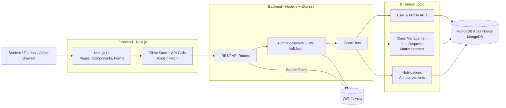
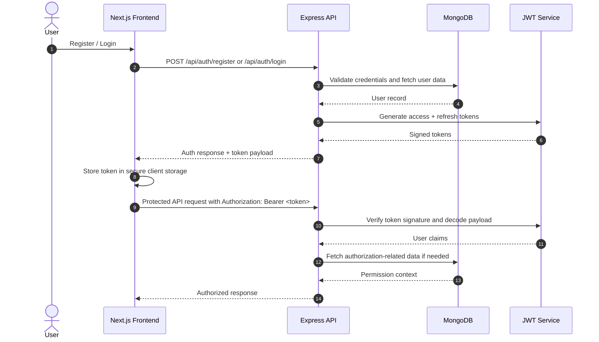
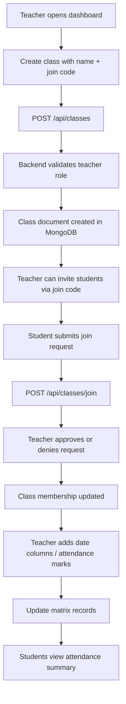
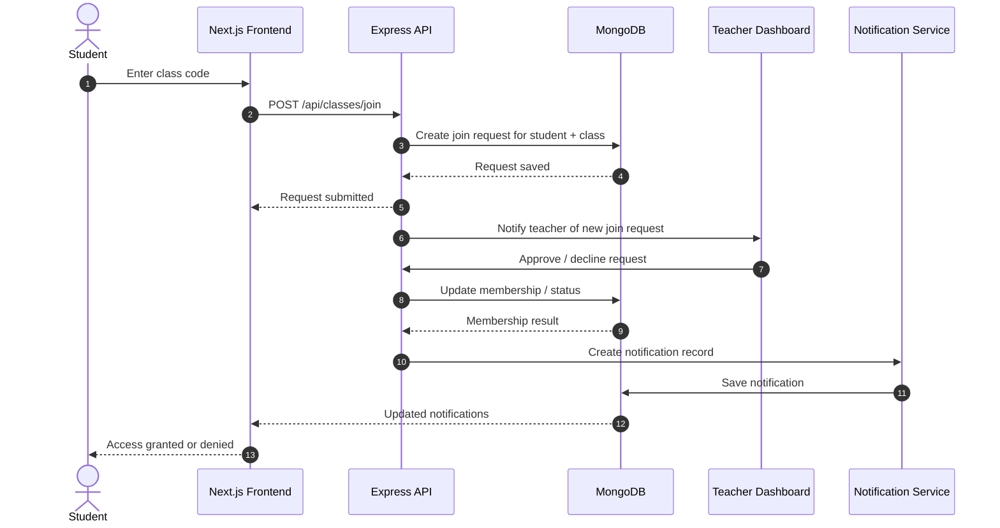
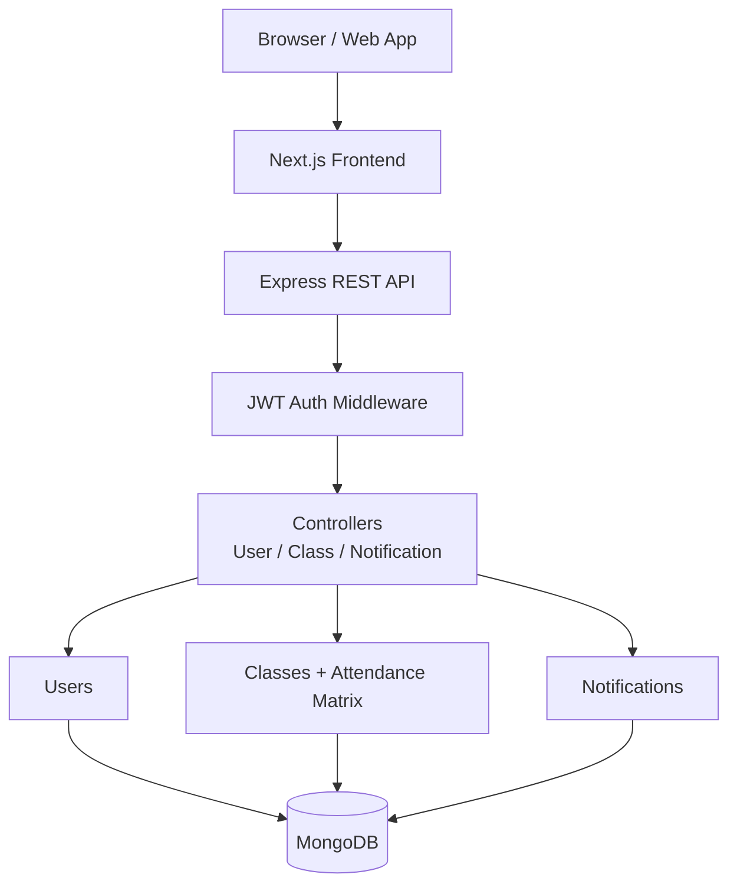

# RollCall Architecture Overview

This document provides a high-level architecture view of the RollCall application and the main interaction flows between the frontend, backend, and data layer.

## 1) System Architecture

### Architectural Notes

- Frontend: Next.js-based React application for the UI, role-based dashboards, attendance matrix, class management, and notifications.
- Backend: Express.js API server responsible for REST endpoints, JWT validation, authorization, and business logic.
- Data Layer: MongoDB stores users, classes, class membership, attendance records, notifications, and related documents.
- Security: Protected endpoints verify JWT tokens via middleware and apply role checks for teacher/admin access.

## 2) Authentication Flow

## 3) Class Creation and Attendance Management Flow

## 4) Student Join Request and Notification Flow

## 5) Attendance Matrix Update Flow

```mermaid
flowchart LR
    T[Teacher] --> U[Open class matrix]
    U --> V[Select student + date column]
    V --> W[PUT /api/classes/:id/cells]
    W --> X[Backend validates permissions]
    X --> Y[Update ClassRecord / attendance values]
    Y --> Z[MongoDB stores cell data]
    Z --> AA[Frontend refreshes matrix view]
    AA --> AB[Student sees updated attendance status]
```

## 6) High-Level End-to-End View

## Summary

RollCall follows a typical MERN-style architecture:

- Next.js frontend for user interaction and dashboards.
- Express API for secure business logic and route handling.
- MongoDB for persistent storage of users, classes, attendance records, and notifications.
- JWT-based authentication for session validation and protected access.
- Role-based restrictions to separate student, teacher, and admin responsibilities.

This architecture supports the app’s core workflows: authentication, class management, attendance tracking, approvals, notifications, and reporting.
