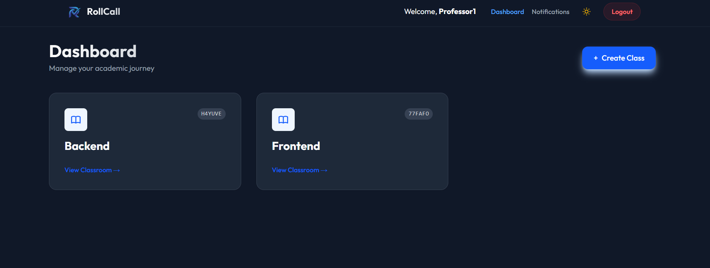
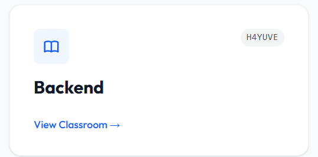
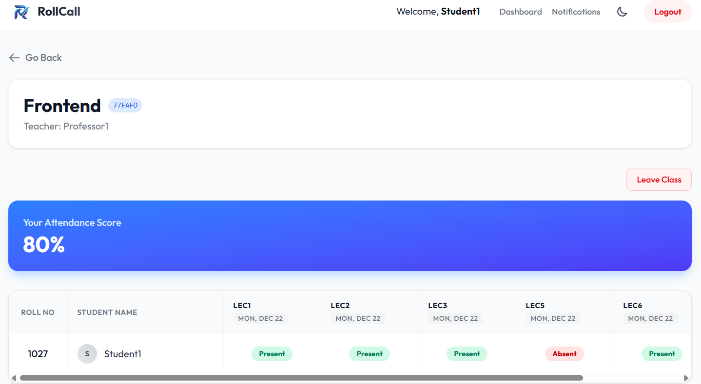
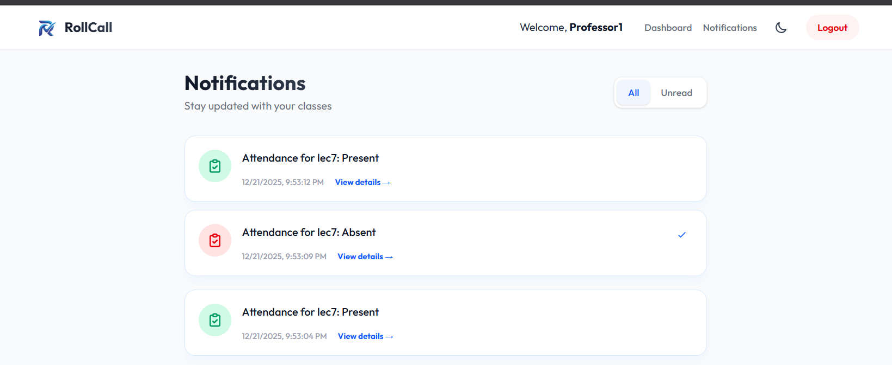

# RollCall - Comprehensive Attendance Management System

RollCall is a modern, full-stack attendance management application designed to streamline the process of tracking attendance, managing classes, and analyzing student performance. It features a premium, user-centric interface and robust backend architecture.

## 🚀 Live Demo

[**View Live Demo Here**](https://roll-call-mu.vercel.app/)

---

## ✨ Key Overview & Features

This application is packed with features designed for both Teachers and Students, providing a seamless educational management experience.

### 📚 Class Management
- **Create & Manage Classes**: Teachers can easily create courses with unique join codes.
- **Archive System**: Keep your dashboard clean by archiving finished classes. Archived classes are stored in a collapsible folder (LIFO) and can be unarchived at any time.
- **Join Requests**: Control access to your class. Teachers approve or decline student join requests securely.

### 📊 Attendance Tracking & Matrix
- **Dynamic Matrix View**: A spreadsheet-like view of all students and attendance dates.
- **Customizable Columns**: Add custom columns for dates, marks, or specific activities.
- **Private Columns**: Mark columns as "Private" to hide them from students (perfect for grading or internal notes).
- **One-Click Status Updates**: Toggle attendance status (Present, Absent, Late, Excused) with a single click.

### 📤 Data Export & Reporting
- **Download CSV**: Export class data to CSV. Choose to include or exclude private columns.
- **Print View**: A clean, printer-friendly version of the class register.

### 🔔 Real-Time Communication & Notifications
- **In-App Alerts**: Comprehensive notification system to keep everyone in the loop.
- **For Students**: Immediate alerts for class removals, join request approvals/denials, and new announcements.
- **For Teachers**: Notifications when a student voluntarily leaves a class or requests to join.

## 📸 Screenshots

<details>
  <summary><b>View Gallery</b> (Click to expand)</summary>
  <br>
  
  **Teacher Dashboard (Dark Mode)**
  
  
  **Dynamic Class Matrix**
  
  
  **Student Analytics View**
  
  
  **Real-Time Notifications**
  
</details>

---

## 🛠️ Languages & Frameworks

### Front-End Stack
-  **Next.js (React)**: Chosen for its powerful Server-Side Rendering (SSR), optimal SEO capabilities, and intuitive file-based routing.
-  **Tailwind CSS**: Used to ensure rapid UI development with a scalable utility-first design system and built-in dark mode support.
-  **TypeScript**: Ensures type safety and highly maintainable codebase on the frontend.

### Back-End Stack
-  **Node.js**: Provides a highly scalable, asynchronous environment for backend logic.
-  **Express.js**: Selected for its minimalist and robust routing capabilities to build RESTful APIs.
-  **MongoDB (Mongoose)**: A NoSQL database that perfectly accommodates the flexible schema needed for dynamic attendance records and class structures.

### Key Dependencies
- **Frontend**: `axios`, `react`, `next`, `tailwindcss`
- **Backend**: `mongoose`, `jsonwebtoken` (JWT), `bcryptjs`, `cors`, `cookie-parser`

---

## 🔐 Authentication & Authorization Workflow

Our application uses a highly secure, stateless JWT-based authentication workflow:

1. **Registration/Login**: The user provides credentials. Passwords are mathematically hashed using `bcryptjs` before hitting the database.
2. **Token Generation**: Upon successful verification, the backend issues an **Access Token** (short-lived) and a **Refresh Token** (long-lived) using `jsonwebtoken`.
3. **API Access**: The client stores the token and attaches it to the `Authorization: Bearer <token>` header for subsequent requests.
4. **Validation**: Every protected route passes through the `authMiddleware`. It intercepts the request, verifies the token signature against the `JWT_SECRET`, decodes the payload, and fetches the user.
5. **Authorization (RBAC)**: Role-specific middlewares (`admin`, `teacher`) further inspect the decoded user payload to ensure the user has the explicit rights to perform the requested action.

---

## 🛡️ Role-Based Access Control (RBAC) Model

| Role | Capabilities |
|---|---|
| **Student (Default)** | Can join classes (via requests), view their own attendance/marks, and leave classes. Cannot modify class structures. |
| **Teacher** | Can create/manage classes, approve/decline join requests, update attendance/marks matrices, manage columns, and archive classes. |
| **Admin** | Full system access. Includes all Teacher privileges plus the ability to view all system users and perform global administrative actions. |

---

## 🗄️ Database Schema & Relationships

| Entity | Description / Attributes | Relationships |
|---|---|---|
| **USER** | `ObjectId _id`<br>`String name`<br>`String email`<br>`String role (admin/teacher/student)` | 👨‍🏫 **Teaches** `CLASS` (1:N)<br>📝 **Enrolls in** `CLASS` (N:M)<br>🔔 **Receives** `NOTIFICATION` (1:N) |
| **CLASS** | `ObjectId _id`<br>`String name`<br>`String code`<br>`ObjectId teacher`<br>`Boolean isArchived` | 📊 **Contains** `CLASSRECORD` (1:N) |
| **CLASS_STUDENT** | `ObjectId class_id`<br>`ObjectId student_id`<br>`String rollNumber` | *Join Collection linking Users and Classes* |
| **CLASSRECORD** | `ObjectId _id`<br>`ObjectId classId`<br>`ObjectId studentId`<br>`ObjectId columnId`<br>`Mixed value` | *Links a Student to a specific Attendance/Marks cell in a Class* |
| **NOTIFICATION** | `ObjectId _id`<br>`ObjectId user`<br>`String message`<br>`Boolean read` | *Belongs to a specific User* |

---


## 🌐 API Routing Reference

| Method | Endpoint | Middleware | Description |
|---|---|---|---|
| **POST** | `/api/auth/register` | None | Registers a new user. |
| **POST** | `/api/auth/login` | None | Authenticates user & returns JWT tokens. |
| **GET** | `/api/users/profile` | `protect` | Retrieves the logged-in user's profile. |
| **GET** | `/api/users` | `protect, admin` | Retrieves all users in the system. |
| **POST** | `/api/classes` | `protect, teacher` | Creates a new class. |
| **GET** | `/api/classes` | `protect` | Fetches classes associated with the user. |
| **POST** | `/api/classes/join` | `protect` | Submits a join request from a student. |
| **PUT** | `/api/classes/:id/approve` | `protect, teacher` | Approves a student's join request. |
| **POST** | `/api/classes/:id/columns` | `protect, teacher` | Adds a new attendance/marks column. |
| **PUT** | `/api/classes/:id/cells` | `protect, teacher` | Updates a specific cell in the matrix. |
| **GET** | `/api/classes/:id/matrix` | `protect` | Retrieves the full attendance matrix. |

*(Note: Sensitive routes are strictly guarded by respective middlewares).*

---

## ⚙️ Setup and Installation

Follow these steps to run the project locally:

### 1. Clone the repository
```bash
git clone <repository_url>
cd Attendance
```

### 2. Backend Setup
```bash
cd backend
npm install
```
Create a `.env` file in the `backend` directory with the required variables (e.g., `PORT`, `MONGO_URI`, `JWT_SECRET`).
```bash
npm run dev
```

### 3. Frontend Setup
```bash
cd frontend
npm install
```
Create a `.env.local` file in the `frontend` directory with your public environment variables (e.g., `NEXT_PUBLIC_API_URL`).
```bash
npm run dev
```

The app will be available at `http://localhost:3000`.

---

## 💖 Support the Project
If you found this project helpful or inspiring, please consider giving it a ⭐ on GitHub! 
**Follow me** for more amazing full-stack projects and web development resources. Your support motivates me to keep building!
